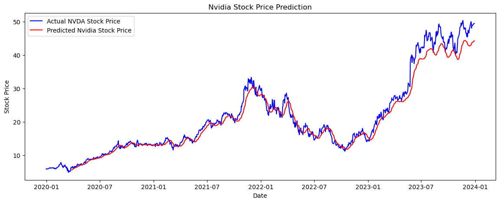

---

## About Me

*I work with data patiently and with purpose, exploring messy datasets until they reveal clear insights. Driven by curiosity, I build projects and experiment with real-world data to uncover the stories behind the numbers.I work with data patiently and with purpose, exploring messy datasets until they reveal clear insights. Driven by curiosity, I build projects using real-world data and enjoy uncovering patterns and stories hidden in numbers. I focus on writing clean analyses, asking the right questions, and learning from every dataset I touch. This GitHub represents my hands-on work, learning journey, and growing expertise in data analytics and data science.*

---

## 💼 Experience

### **Trainity — Data Analyst Intern**  
📅 Feb 2025 – Jun 2025  
- Performed **EDA and data analysis** using SQL and Excel on user behavior and operational metrics  
- Built dashboards and reports using **Pivot Tables, KPIs, and charts**
- Delivered actionable insights using **statistical and trend analysis**

---

### **360DigiTMG — Data Science Intern**  
📅 Aug 2024 – Dec 2024  
- Built and deployed a **Credit Card Fraud Detection system** using **XGBoost + SMOTE**, achieving **97.7% AUC**
- Developed a **real-time Streamlit app** for fraud detection  
- Analyzed **20,000+ Zomato reviews** using **NLP & sentiment analysis** to study cuisine trends and pricing behavior

---

### **Innodatatics — ML Intern**  
📅 Apr 2024 – May 2024  
- Worked on **Optimization of Machine Downtime**, reducing downtime by **10%**
- Achieved **95% prediction accuracy** using machine learning models  
- Deployed the solution via a **Streamlit application** for manufacturing workflows

---

## 📊 Projects

### 🔹 NVIDIA Stock Price Prediction
- Performed **time-series analysis** to identify trends, seasonality, and volatility in NVIDIA stock data.
- Built an **LSTM-based forecasting model** using a rolling prediction approach to capture market patterns.
- Translated model outputs into actionable insights for understanding future price movements.

---

### 🔹 Mobile Device Usage Analysis
- Explored mobile device usage data to understand how users interact with apps and consume battery resources.
- Translated analysis into a clear, interactive **Power BI dashboard** that highlights usage patterns and supports smarter product decisions.

---

### 🔹 IMDB Movie Recommendation System
- Analyzed **10,000+ IMDB records** to uncover patterns in ratings, genres, budgets, and revenues.
- Developed a **content-based** recommendation system using **TF-IDF** and cosine similarity.
- Visualized insights to explain factors influencing movie performance and user preferences

---

## 🎓 Education

**Postgraduate Diploma in Data Science & Business Analytics**  
St. Francis College for Women, Hyderabad  
📊 GPA: **9.6 / 10** | 2023 – 2024  

**B.Sc. (Computer Applications, Biochemistry & Chemistry)**  
St. Francis College for Women, Hyderabad  
📊 GPA: **8.4 / 10** | 2019 – 2022  

---

## 📜 Certifications

- **SQL BASICS CERTIFICATE** by Hacker Rank obtained in Oct 2024		
- **DATA VISUALIZATION USING POWER BI** by 360DigiTMG Obtained in Sep 2023	
- **PYTHON BOOTCAMP** by Udemy	
 

---

## 🛠️ Technical Skills

- **Languages**: Python, SQL (MySQL)

- **Tools**: Excel, Power BI, Google Sheets

- **Libraries**: Pandas, NumPy, Matplotlib, Seaborn, Scikit-learn, Plotly

- **Analytics**: EDA, Data Cleaning, Statistical Analysis, KPI Analysis, A/B Testing, Trend Analysis

- **Machine Learning**: Predictive Modeling, Segmentation, Anomaly Detection, XGBoost, LSTM, Time Series Forecasting, NLP, Text Preprocessing, TF-IDF, Sentiment Analysis

- **Visualization & Reporting**: Dashboards, Pivot Tables, Data Storytelling

- **Deployment**: Streamlit

- **Professional Skills**: Analytical Thinking, Problem Solving, Communication, Collaboration

## ✨ Let’s Connect

I’m actively looking for opportunities in **Data Science & Analytics** where I can learn, grow, and make an impact.
⭐ If you like my work, feel free to explore my repositories and connect with me!   

📍 Hyderabad, India  
📧 priyamethre01@gmail.com 
|📞 8106905367  
[LinkedIn](https://www.linkedin.com/in/priyamethre) 
|
[Portfolio](https://priyamethre.github.io/) 

